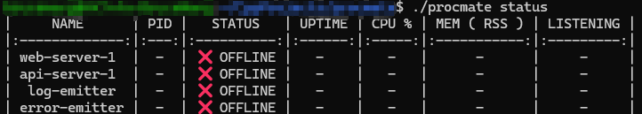
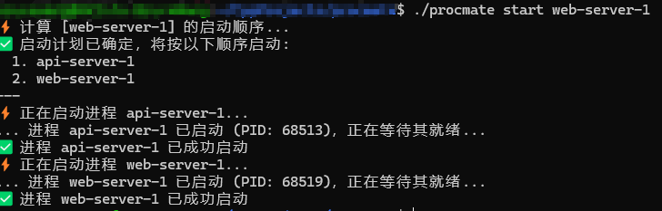
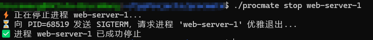

# Procmate - 进程伴侣

一个使用 Go 语言编写的、强大且可配置的命令行工具，用于管理和守护本地长时间运行的进程。

好的，当然。这段功能描述写得不错，但确实可以通过调整措辞和结构，让它更具吸引力、更流畅、更专业。

这是我为您优化后的版本，您可以感受一下其中的区别：

---

### ✨ 功能特性

- **集中化配置，简化管理**
  通过单一、清晰的 `config.yaml` 文件，即可对所有受管进程进行统一配置，彻底告别繁杂、分散的启停脚本。

- **全生命周期管理**
  提供 `start`, `stop`, `status`, `log` 等一系列标准化命令，让您全面掌控进程的启停、状态与日志，操作直观统一。

- **高可用守护进程**
  内置强大的守护进程 (`watch`)，配合systemd能够 7x24 小时监控核心服务，并在进程意外崩溃时实现毫秒级自动拉起，确保业务持续在线。

- **深度定制化选项**
  - **超时控制**: 精确定义每个进程的启停超时时间，防止进程假死阻塞。
  - **环境变量**: 为不同进程灵活注入所需的环境变量，轻松实现环境隔离。
  - **日志路径**: 自由指定日志文件的存储位置，完美适配现有运维规范。

- **自动化日志聚合**
  自动捕获所有进程的标准输出 (`stdout`) 与标准错误 (`stderr`)，并重定向至独立的日志文件，让问题排查与审计有据可循。

- **无缝集成 Systemd**
  可一键生成标准的 `systemd` 服务单元文件，轻松纳入现代 Linux 的服务管理体系，实现真正的开机自启与可靠托管。

- **极致的可移植性**
  基于 Go 语言静态编译，生成无任何外部依赖的单一二进制文件。真正做到“一次编译，到处运行”，彻底告别因 `glibc` 版本不兼容引发的部署噩梦。


## 💡 使用方法

确保您的 `config.yaml` 文件存在。您可以通过 `--config` 或 `-f` 标志来指定其路径。

- **检查所有进程的状态**

  ```bash
  procmate status
  ```
  
- **启动所有已启用的进程**

  ```bash
  procmate start
  # 或者
  procmate start all
  ```

- **启动单个进程**

  ```bash
  procmate start [name]
  ```
  
- **停止所有进程**

  ```bash
  procmate stop
  ```

- **停止单个进程**

  ```bash
  procmate stop [name]
  ```
  

- **查看某进程日志**

  ```bash
  procmate log [name]
  ```
  

- **启动守护模式** (通常在前台运行用于调试，或通过 systemd 在后台运行)

  ```bash
  procmate watch
  ```

- **指定配置文件路径**

  ```bash
  procmate --config /etc/procmate/config.yaml status
  ```

## 🛡️ 作为 Systemd 服务运行

`procmate` 被设计为在 `systemd`下作为服务运行，以实现后台守护和开机自启。

项目提供的 `install.sh` 脚本会自动完成服务的安装和启用。您无需手动创建服务文件。

安装完成后，您可以使用标准的 `systemctl` 命令来管理 `procmate` 服务：

-   **启动服务**
    ```bash
    sudo systemctl start procmate
    ```

-   **查看服务状态**
    ```bash
    sudo systemctl status procmate
    ```

-   **停止服务**
    ```bash
    sudo systemctl stop procmate
    ```

-   **查看实时日志**
    ```bash
    sudo journalctl -u procmate -f
    ```


## 🚀 安装

1. **编译**

   在项目根目录下，运行以下命令来编译一个静态链接的、可在任何 Linux (amd64) 系统上运行的二进制文件：

   ```bash
   CGO_ENABLED=0 GOOS=linux GOARCH=amd64 go build -o procmate main.go
   ```

2. **放置到系统路径**

   将编译好的 `procmate` 文件移动到系统的可执行路径下，以便在任何地方都能调用它。

   ```bash
    tar -zxf procmate_xxx.tar.gz

    cd  procmate_xxx

    chmod +x install.sh

    ./install.sh

   ```

## ⚙️ 配置示意

`procmate` 采用分层配置系统，清晰地将全局设置与单个进程定义分离开来。默认配置路径位于 `/etc/procmate/`。

### 1. 主配置文件: `config.yaml`

该文件负责定义全局设置和指定服务配置目录。

-   **`settings`**: 定义全局参数，如默认超时、日志轮转策略等。
-   **`include`**: 一个关键指令，告诉 `procmate` 去哪里加载所有的服务定义文件。它支持 [glob](https://en.wikipedia.org/wiki/Glob_(programming)) 模式。

**示例 `/etc/procmate/config.yaml`:**

```yaml
# 全局默认设置
settings:
  runtime_dir: /tmp/procmate # 运行时文件 (pid, logs) 的根目录
  default_start_timeout_sec: 60 # 默认启动超时 (秒)
  default_stop_timeout_sec: 10 # 默认停止超时 (秒)
  watch_interval_sec: 10 # 'watch' 命令的轮询周期 (秒)
  log_options:
    max_size_mb: 10000
    max_backups: 10
    max_age_days: 30
    compress: true
    localTime: true

# 指向服务定义文件所在的目录
include: "conf.d/*.yaml"
```

### 2. 服务定义目录: `conf.d/`

该目录下的每一个 `.yaml` 文件都用于定义一组相关的进程。这种方式使得添加、删除和管理单个服务变得非常模块化和清晰。

**示例 `/etc/procmate/conf.d/web_services.yaml`:**

```yaml
# 定义一组 Web 相关的服务
processes:
  - name: web-server-1
    group: web
    command: "while true; do { echo -e 'HTTP/1.1 200 OK\r\n\r\nHello'; } | nc -l -p 8080; done"
    workdir: "/tmp"
    port: 8080
    enabled: true
    depends_on:
     - api-server-1

  - name: api-server-1
    group: api
    command: "..."
    workdir: "/app/api"
    port: 8081
    enabled: true
    environment:
      API_KEY: "your-secret-key"
```

**注意**: 如果多个文件中定义了同名的进程，后加载的文件会覆盖先加载的，并且 `procmate` 会在启动时打印警告信息。
